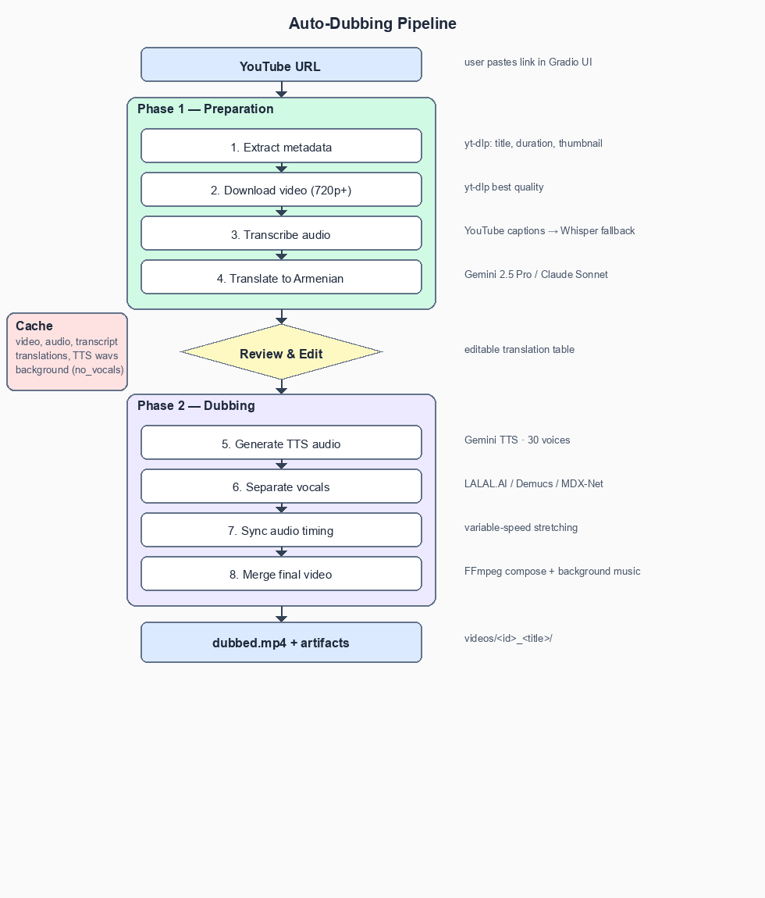

# Auto Dubbing

An end-to-end pipeline that automatically dubs English YouTube videos into Armenian. Downloads the video, transcribes it, translates with LLMs, generates native Armenian speech with Gemini TTS, preserves background music, and produces a final dubbed video — all with a human-in-the-loop translation review step.

## How It Works

The pipeline runs in two phases with a review step in between:



```
YouTube URL
    │
    ▼
┌─────────────────────────────┐
│  Phase 1: Preparation       │
│  1. Extract metadata        │
│  2. Download video (720p+)  │
│  3. Extract transcript      │
│     (YouTube captions or    │
│      Whisper fallback)      │
│  4. Translate to Armenian   │
│     (Gemini or Claude)      │
└─────────────┬───────────────┘
              │
     ✏️ User reviews & edits
        translations
              │
┌─────────────▼───────────────┐
│  Phase 2: Dubbing           │
│  5. Generate TTS audio      │
│     (Gemini Flash/Pro)      │
│  6. Separate vocals from    │
│     background music        │
│     (LALAL.AI / Demucs)     │
│  7. Sync audio timing       │
│     (variable-speed video)  │
│  8. Merge final video       │
└─────────────┬───────────────┘
              │
              ▼
    videos/<id>_<title>/
    ├── dubbed.mp4
    ├── original.mp4
    ├── transcript.json
    ├── metadata.json
    ├── video_info.txt
    ├── thumbnail.jpg
    ├── background_music.wav
    └── cost.txt
```

## Features

- **Two-phase workflow** — review and edit translations before committing to TTS
- **Multiple translation providers** — Gemini 2.5 Pro or Claude Sonnet
- **Gemini TTS** — 30 voice options, Flash or Pro models, native Armenian speech
- **Background music preservation** — vocal separation via LALAL.AI (cloud), Demucs, or MDX-Net
- **Variable-speed video sync** — stretches video when Armenian translation runs longer than English
- **Aggressive caching** — video, audio, transcripts, translations, and TTS are cached per video; re-runs skip completed steps
- **Highest quality downloads** — yt-dlp grabs the best available resolution (720p+)
- **Cost tracking** — real-time API cost breakdown for every run
- **Gradio web UI** — browser-based interface with progress tracking
- **Thumbnail & metadata export** — saves highest-quality thumbnail, title, description, and channel URL

## Setup

### Prerequisites

- Python 3.10+
- [FFmpeg](https://ffmpeg.org/download.html) installed and on PATH

### Installation

```bash
git clone <repo-url>
cd auto_dubbing
pip install -r requirements.txt
```

### API Keys

Copy the example env file and fill in your keys:

```bash
cp .env.example .env
```

```env
# Required — for Gemini translation + TTS
GOOGLE_API_KEY=AIza...

# Optional — for Claude translation
ANTHROPIC_API_KEY=sk-ant-...

# Optional — for LALAL.AI cloud vocal separation
LALAL_API_KEY=...
```

At minimum you need `GOOGLE_API_KEY` for Gemini translation and TTS.

## Usage

### Web UI (Gradio)

```bash
python app.py
```

Opens a browser interface where you can paste a YouTube URL, configure settings, review translations in an editable table, and generate the dubbed video.

### CLI / Script

```python
from config import Config
from pipeline import run_pipeline_phase1, run_pipeline_phase2

config = Config.from_env()

# Phase 1: download, transcribe, translate
phase1 = run_pipeline_phase1("https://www.youtube.com/watch?v=VIDEO_ID", config)

# Review phase1.translated_segments, edit as needed...

# Phase 2: TTS, vocal separation, video merge
result = run_pipeline_phase2(phase1, edited_segments)
print(result.output_video_path)  # videos/<id>_<title>/dubbed.mp4
```

## Configuration

All settings are in `config.py`. Key options:

| Setting | Default | Description |
|---------|---------|-------------|
| `translation_provider` | `"gemini"` | `"gemini"` or `"claude"` |
| `gemini_model` | `"gemini-2.5-pro"` | Model for translation |
| `gemini_tts_model` | `"gemini-2.5-flash-preview-tts"` | TTS model (flash or pro) |
| `tts_voice_name` | `"Charon"` | Voice for Armenian speech ([30 options](https://ai.google.dev/gemini-api/docs/text-generation#voice-options)) |
| `vocal_separator` | `"lalal"` | `"lalal"`, `"demucs"`, or `"mdx"` |
| `keep_background_music` | `True` | Preserve original background music |
| `speed_min` / `speed_max` | `0.75` / `1.35` | TTS speed adjustment bounds |
| `segment_min_duration` | `5.0` | Merge segments shorter than this (seconds) |
| `segment_max_duration` | `30.0` | Split segments longer than this (seconds) |

### Available TTS Voices

Zephyr, Puck, Charon, Kore, Fenrir, Leda, Orus, Aoede, Callirrhoe, Autonoe, Enceladus, Iapetus, Umbriel, Algieba, Despina, Erinome, Algenib, Rasalgethi, Laomedeia, Achernar, Alnilam, Schedar, Gacrux, Pulcherrima, Achird, Zubenelgenubi, Vindemiatrix, Sadachbia, Sadaltager, Sulafat

## Project Structure

```
auto_dubbing/
├── app.py                    # Gradio web UI
├── config.py                 # Configuration (API keys, models, settings)
├── pipeline.py               # Two-phase pipeline orchestration
├── modules/
│   ├── downloader.py         # yt-dlp video download + thumbnail + metadata
│   ├── transcript.py         # YouTube captions / Whisper transcription + segmentation
│   ├── translator.py         # LLM translation (Gemini / Claude) with batching
│   ├── tts.py                # Gemini TTS synthesis with caching
│   ├── vocal_separator.py    # Vocal separation (LALAL.AI / Demucs / MDX-Net)
│   ├── audio_sync.py         # Audio timing alignment + variable-speed regions
│   ├── video_merge.py        # FFmpeg variable-speed video + audio merge
│   ├── cache.py              # Per-video file-system cache
│   └── temp_manager.py       # Temporary directory lifecycle
├── utils/
│   ├── audio_utils.py        # Audio speed change + silence generation
│   ├── cost_tracker.py       # API cost calculation + summary
│   └── text_utils.py         # Caption text cleaning + sentence splitting
├── cache/                    # Per-video cached artifacts (auto-generated)
├── videos/                   # Final output directories (auto-generated)
├── requirements.txt
├── .env.example
└── .env                      # Your API keys (not committed)
```

## How Audio Sync Works

Armenian translations are typically longer than English originals. The pipeline handles this with a variable-speed approach:

1. **TTS fits in time** (ratio 0.75x–1.35x) — audio is sped up/slowed to match the original segment duration
2. **TTS too long** (ratio > 1.35x) — audio is sped up to max (1.35x), and the *video* is slowed down to compensate, stretching the timeline
3. **TTS too short** (ratio < 0.75x) — audio is slowed to min (0.75x) and padded with silence

Background music is time-warped to match the new variable-speed timeline so it stays in sync.

## Caching

Every artifact is cached under `cache/<video_id>/`:

- `video.mp4` — downloaded video
- `audio.wav` — extracted audio
- `transcript_*.json` — transcriptions (keyed by Whisper model + segment bounds)
- `translation_*.json` — translations (hashed by content + provider + model)
- `tts/*.wav` — individual TTS audio segments (hashed by text + voice + model)
- `no_vocals.wav` — separated background audio

Re-running a video skips all cached steps. Only changed translations trigger new TTS.

## Cost

Typical costs per video (using Gemini):

| Component | ~Cost per minute of video |
|-----------|--------------------------|
| Translation (Gemini 2.5 Pro) | ~$0.01 |
| TTS (Gemini Flash) | ~$0.02 |
| LALAL.AI separation | Free tier / paid plan |
| **Total** | **~$0.03/min** |

The pipeline prints a cost summary after each run.

## License

MIT
